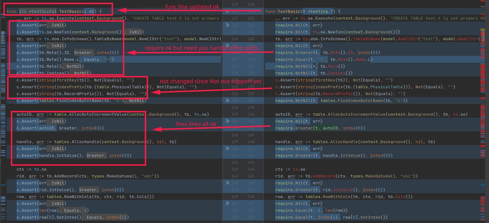

# migrate-helper

`tidb` project need to [restructure tests](https://github.com/pingcap/tidb/issues/26022), migrating its old `gocheck` tests to 
`testify` tests. there are so many files need to migrate that I write this helper to do the regular replacements, then
manually check and update.

other projects which want to migrate from `gocheck` to `testify` can use too.

## install

```go
go install github.com/feitian124/migrate-helper
```

## usage

```shell
migrate-helper path/to/my_gocheck_test.go 
# path/to/my_gocheck_test.go_updated will created

migrate-helper -w path/to/my_gocheck_test.go 
# path/to/my_gocheck_test.go will updated

migrate-helper path/to/folder 
# all files under the folder and name ends with "_test.go" will be processed
```

lines like `c.Assert(err, IsNil)` will be replaced to `require.NoError(t, err)`, 
then you can review and change other parts.



## supported 

- Equals, DeepEquals
- IsNil, NotNil, IsTrue, IsFalse
- Greater, GreaterEqual, LessEqual
- HasLen

...

see tests for full list.

## known issue

- Assert with `Commentf` not support yet
- Assert with multiline string as param not support yet
